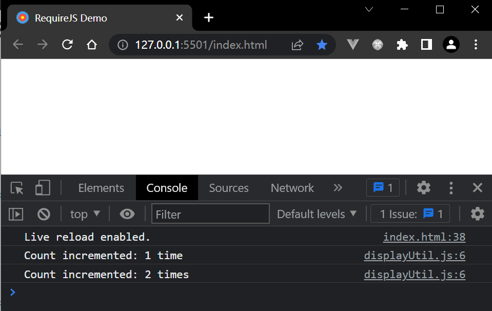

# Ch 3 Modular JavaScript


## 3.5. Module loading and dependency management


> **DEMO**
>
> The counter module using `RequireJS`
>
> 1. download `RequireJS` library ([download](https://requirejs.org/docs/download.html#requirejs))
> 2. init project
> 3. import and config `RequireJS`
> 4. create modules & dependencies
> 5. launch the project via live server


### 1 download `RequireJS`

Save as `require.js` file.


### 2 init project

```powershell
# create a folder
md reqjs | Out-Null
cd reqjs
# create sub folders
md -p app/example/modules, thirdParty | Out-Null
# create new files
ni -Path app/example/modules -Name "counter.js","displayUtil.js" | Out-Null
ni -Path app/example/modules -Name "counter.js" | Out-Null
ni -Path app/example/modules -Name "displayUtil.js" | Out-Null
ni index.html | Out-Null
ni main.js | Out-Null
# copy resource files needed
mv ../require.js ./thirdParty
mv ../favicon.ico .
# open project root folder with VSCode
code .
```


### 3 fill content for each new file

#### 3.1. index.html

```html
<!DOCTYPE html>
<html lang="en">
<head>
    <meta charset="UTF-8">
    <title>RequireJS Demo</title>
    <link rel="shortcut icon" href="favicon.ico" type="image/x-icon">
</head>
<body>
    <script data-main="main.js" src="thirdParty/require.js"></script>
</body>
</html>
```

Pay attention to the script tag (`data-main` attribute)


#### 3.2. main.js

```js
requirejs.config({
    baseUrl: 'app/example',
    paths: {
        counter: 'modules/counter',
        util: 'modules/displayUtil'
    }
});

require(['util'], function(utilModule) {
    // increment 1st time
    utilModule.displayNewCount();
    // increment 2nd time
    utilModule.displayNewCount();
});
```


#### 3.3. counter.js

Use `define` syntax: ('cause no dependencies, no parameters then)

```js
define(function() {
    'use strict';
    let count = 0;
    
    function incrementCount() {
        ++count;
    }

    function getCount() {
        return count;
    }

    return {
        incrementCount,
        getCount
    };
});
```


#### 3.4. displayUtil.js

```js
define(['counter'], function(counterModule) {
    'use strict';
    function printCount() {
        const count = counterModule.getCount();
        const res = `${count} time${count === 1 ? '' : 's'}`;
        console.log(`Count incremented: ${res}`);
    }

    function displayNewCount() {
        counterModule.incrementCount();
        this.printCount();
    }

    return {
        printCount,
        displayNewCount
    };
});
```


3.5. launch the demo

Use VSCode Live Server plugin to launch the demo project.

(open index.html)

<kbd>Alt+L Alt+O</kbd>

When a web page has been opened by a browser (e.g. Chrome), press <kbd>F12</kbd> to examine the console:

```markdown
Live reload enabled.
displayUtil.js:6 Count incremented: 1 time
displayUtil.js:6 Count incremented: 2 times
```

something like this:



