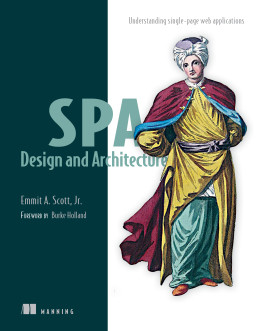

# 《SPA Design and Architecture》Learning Notes


## 1. Profiles



|    **Title**    | **SPA Design and Architecture** [ISBN: 9781617292439] |
| :-------------: | :---------------------------------------------------: |
|   **Author**    |                **Emmit A. Scott, Jr.**                |
| **Publication** |                 **Manning, 2015.11**                  |
|    **Pages**    |                        **312**                        |

> **Introduction**
>
> *SPA Design and Architecture* teaches you the design and development skills you need to create SPAs. Includes an overview of MV* frameworks, unit testing, routing, layout management, data access, pub/sub, and client-side task automation. This book is full of easy-to-follow examples you can apply to the library or framework of your choice.
>
> **about the technology**
>
> The next step in the development of web-based software, single-page web applications deliver the sleekness and fluidity of a native desktop application in a browser. If you're ready to make the leap from traditional web applications to SPAs, but don't know where to begin, this book will get you going.
>
> **about the book**
>
> *SPA Design and Architecture* teaches you the design and development skills you need to create SPAs. You'll start with an introduction to the SPA model and see how it builds on the standard approach using linked pages. The author guides you through the practical issues of building an SPA, including an overview of MV* frameworks, unit testing, routing, layout management, data access, pub/sub, and client-side task automation. This book is full of easy-to-follow examples you can apply to the library or framework of your choice.


## 2. Outlines

Status available：:heavy_check_mark: (Completed) | :hourglass_flowing_sand: (Working) | :no_entry: (Not Started) | :orange_book: (Finish reading)

| No.  |                 Chapter Title                  |          Status          |
| :--: | :--------------------------------------------: | :----------------------: |
|      |             **Part 1 The basics**              |                          |
| Ch01 | [What is a single-page application](./Ch01.md) | :hourglass_flowing_sand: |
| Ch02 |    [The role of MV* frameworks](./Ch02.md)     |        :no_entry:        |
| Ch03 |        [Modular JavaScript](./Ch03.md)         |        :no_entry:        |
|      |            **Part 2 Core concepts**            |                          |
| Ch04 |    [Navigating the single page](./Ch04.md)     |        :no_entry:        |
| Ch05 |    [View composition and layout](./Ch05.md)    |        :no_entry:        |
| Ch06 |     [Inter-module interaction](./Ch06.md)      |        :no_entry:        |
| Ch07 |   [Communicating with the server](./Ch07.md)   |        :no_entry:        |
| Ch08 |           [Unit testing](./Ch08.md)            |        :no_entry:        |
| Ch09 |    [Client-side task automation](./Ch09.md)    |        :no_entry:        |


Powershell script for generating markdown files in batch:

```powershell
# Create 9 empty markdown files named Ch##.md:
for($i=1; $i -le 9; $i=$i+1){ New-Item -Name "Ch$('{0:d2}' -f $i).md"; }
```

 
